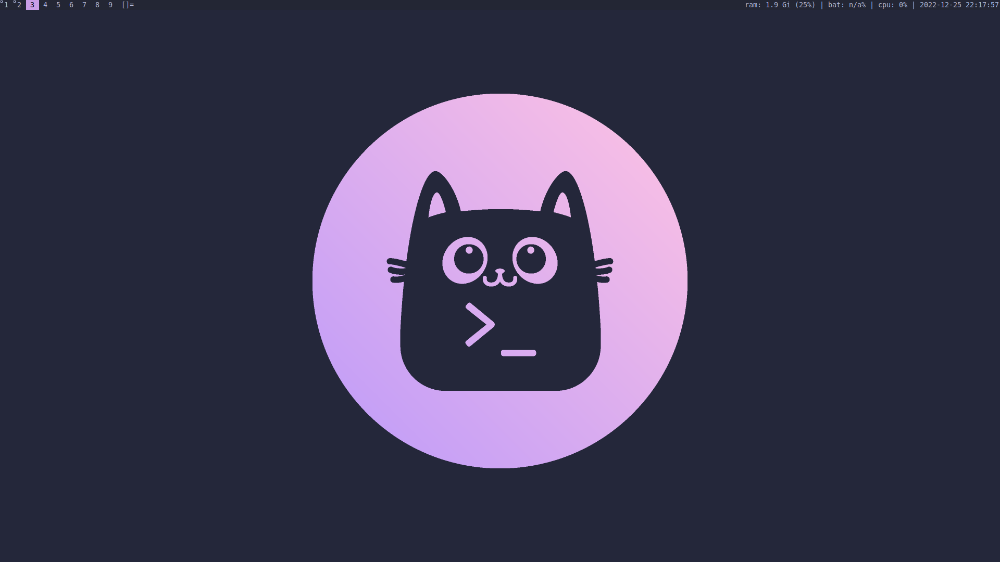

# Wally's dwm config
A simple and cute dwm config with catppuccin colors c:

## Demo

## Install

### Dependencies
- [dunst](https://github.com/dunst-project/dunst)
- [feh](https://github.com/derf/feh) (setting wallpaper)

### Status bar
1. clone the repo: `git clone https://github.com/mWalrus/slstatus`
2. `cd slstatus`
3. OPTIONAL: choose status config:
    - `git checkout laptop` (includes battery info)
3. `make && sudo make clean install`

### Dwm
1. clone the repo: `git clone https://github.com/mWalrus/dwm`
2. `cd dwm`
3. `make && sudo make clean install`
4. reboot
5. select `dwm` from your display manager

## Modified defaults
`termcmd` launches alacritty in this config instead of st.

Default browser keybind is set to launch `firefox` so if you use another browser you
can also change this.

The above can be changed in `config.h` if you want :)

## Patches applied
- [attachbottom](https://dwm.suckless.org/patches/attachbottom/)
- [colorbar](https://dwm.suckless.org/patches/colorbar/)
- [cool autostart](https://dwm.suckless.org/patches/cool_autostart/)
- [cursorwarp](https://dwm.suckless.org/patches/cursorwarp/)
- [exitmenu](https://dwm.suckless.org/patches/exitmenu/)
- [restartsig](https://dwm.suckless.org/patches/restartsig/)
- [statusallmons](https://dwm.suckless.org/patches/statusallmons/)
- [preserveonrestart](https://dwm.suckless.org/patches/preserveonrestart/)
- [doublepressquit](https://dwm.suckless.org/patches/doublepressquit/)
- [rotatestack](https://dwm.suckless.org/patches/rotatestack/)
- [statuspadding](https://dwm.suckless.org/patches/statuspadding/)

## Keybinds
|Bind|Description|Notes|
|-|-|-|
|PrtSc|Launch flameshot (screenshot tool)|Requires [flameshot](https://github.com/flameshot-org/flameshot)|
|Mod+b|Launch firefox|Requires firefox|
|Mod+d|Launch discord|Requires discord|
|Mod+c|Launch chatterino|Requires chatterino|
|Mod+Shift+b|Toggle bar||
|Mod+Shift+q|Kill focused client||
|Mod+Shift+p|Launch exit menu||
|Mod+q|Exit dwm|Double press to perform action|
|Mod+Shift+Up|Increase volume||
|Mod+Shift+Down|Decrease volume||
|Mod+Shift+m|Mute volume||
