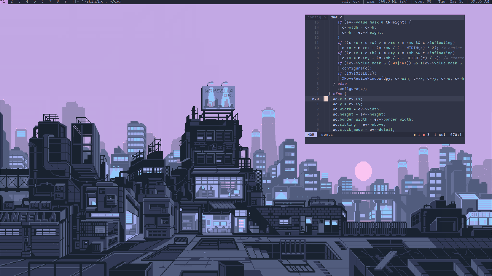

# Wally's dwm config
A simple and cute dwm config c:

## Patches applied
- [attachbottom](https://dwm.suckless.org/patches/attachbottom/)
- [colorbar](https://dwm.suckless.org/patches/colorbar/)
- [cool autostart](https://dwm.suckless.org/patches/cool_autostart/)
- [cursorwarp](https://dwm.suckless.org/patches/cursorwarp/)
- [exitmenu](https://dwm.suckless.org/patches/exitmenu/)
- [restartsig](https://dwm.suckless.org/patches/restartsig/)
- [statusallmons](https://dwm.suckless.org/patches/statusallmons/)

## Demo

